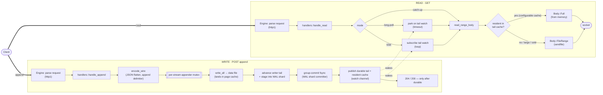
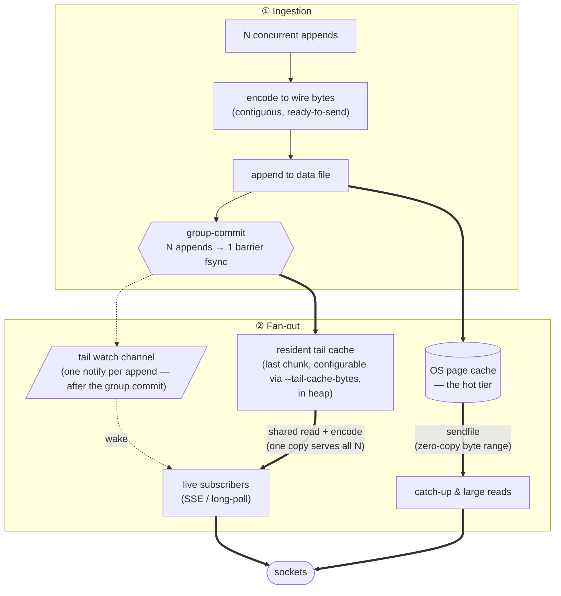
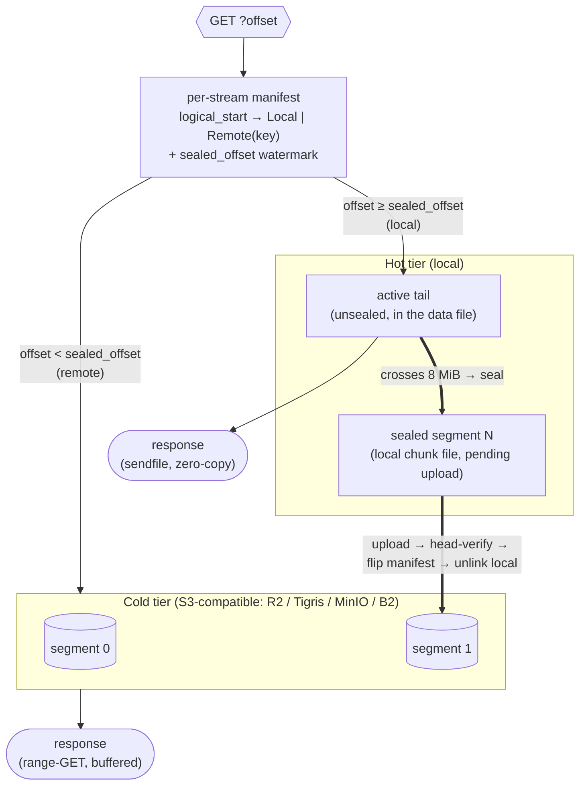

# Architecture & performance

A reference for how the Rust Durable Streams server is built and why it's fast. The thesis in one line: **store each stream as the exact bytes that go on the wire, so a write is an append and a read is a byte range** — then make the append durable cheaply and the read leave the kernel as few times as possible.

- [The model](#the-model)
- [High-level: write path and read path](#high-level-write-path-and-read-path)
- [Write path in detail](#write-path-in-detail)
- [Durability](#durability)
- [Read path in detail](#read-path-in-detail)
- [Keeping I/O fast from ingestion to fan-out](#keeping-io-fast-from-ingestion-to-fan-out)
- [Where the time goes](#where-the-time-goes)
- [Tiering: hot buffer → cold storage](#tiering-hot-buffer--cold-storage-optional)
- [Optional fast paths & observability](#optional-fast-paths--observability)

## The model

A stream is an append-only log. On disk it's a single contiguous data file holding **exactly the wire bytes** a reader receives, plus a small `.meta` sidecar for recovery. There is no per-message framing on disk, no reframing on read, no database, no broker — just a process and a data directory (`store::StreamState`).

Two things fall out of that choice:

- A **read is a `pread`/byte-range** of the file → it is served with `sendfile(2)` on Linux (kernel page cache → socket, zero-copy), positioned reads elsewhere.
- An **append is a `write` + an `fsync`** (in `wal` mode; `memory` mode omits the fsync — see [Durability modes](#durability-modes)) → durability cost is dominated by the fsync, which we amortize across concurrent writers.

The HTTP layer is a single hand-rolled HTTP/1.1 loop (`engine_raw`) — no framework — so it owns the socket and can serve reads zero-copy.

## High-level: write path and read path

The dotted edges are the only coupling between writers and readers: publishing the new tail on a per-stream `watch` channel is what wakes live subscribers. Everything else is independent.

## Write path in detail

`handlers::handle_append` (src/handlers.rs):

1. **Parse idempotency headers** — `Producer-Id` / `Producer-Epoch` / `Stream-Seq`. A duplicate `(producer, epoch, seq)` is acknowledged without re-appending only when committed producer state proves it completed. A pending producer duplicate returns retryable 503. An ordinary `Stream-Seq` conflict waits outside the append lock for committed metadata promotion, then rechecks admission before reporting 409; its writer reservation is not durability proof. Conditional sequence requests retain retryable 503 for pending durability. Duplicate response headers report committed sequence state.
2. **`encode_wire`** — turn the request body into the contiguous wire representation. In JSON mode this flattens arrays and appends the `,` delimiter so the on-disk bytes are already a valid stream fragment.
3. **Acquire the per-stream appender mutex** (`AsyncMutex<Appender>`). It orders that stream's file writes and WAL staging, and releases before the durability wait and reader publication.
4. **`write_wire`** — `write_all` the bytes to the data file (they land in the OS page cache immediately) and advance the _writer_ tail (`Shared.tail`) under a short `RwLock` write. The reader-observable tail does **not** move yet.
5. **Durability, then visibility** — in `wal` mode the append is staged into the stream's assigned WAL shard (under the appender mutex, so per-stream LSN order matches byte order) and the handler awaits the shard's group-commit `fdatasync`. Only after the record is durable does `publish_durable_tail` advance the **reader-observable `durable_tail`** (monotonically), populate the **resident tail cache**, and **publish on the `watch` channel** — cache before wake, so a woken subscriber reliably hits it. Then the 2xx is returned. See [Durability](#durability) below. In `memory` mode the same buffered path runs with the WAL stage/wait skipped: the page-cache write is the ack.

Visibility is gated on durability (PROTOCOL.md §4.1): a live reader never observes bytes (or an EOF) that a crash could roll back. The writer tail runs ahead in `Shared.tail`; readers see `durable_tail`, which follows it as group commits resolve.

Runtime cache and notification publication share the watch channel's existing value write lock (`send_if_modified`). A delayed append whose bytes are no newer, or whose open candidate follows a published close, changes neither the cache nor the notification. An accepted append installs its cache before updating the watch and waking readers. Durable close uses the same boundary, preserves the cache, keeps the byte frontier monotonic and makes closure sticky. A higher closed candidate remains valid for the body of an initially closed PUT. Shared-state promotion precedes this boundary without nesting its lock; reactor wake follows publication lock release. There is no additional per-stream mutex or map. This fixes out-of-order callbacks affecting inline SSE and prompt long-poll delivery; reproduction and qualification are recorded in [0031](../../docs/backlog/0031-tail-watch-publication-can-regress-after-close.md).

Each producer entry has a writer value and an optional committed value, sharing one producer key and map allocation. Writer ordering still rejects stale epochs and sequence gaps. After durability, ordinary appends promote their own producer and writer-sequence deltas monotonically; a later failed stage rolls back writer state without undoing an earlier callback's promotion. General metadata writers capture only committed producer/sequence values and reader-visible closure, so a sweep, checkpoint or tier manifest write cannot persist a rejected append's speculative state. This adds committed values per producer; it is not a bound on producer cardinality or process memory.

`Stream-Seq` body appends additionally retain sequence identity with their bytes in WAL kind 5.
HEAD exposes the committed sequence and durable tail from one shared-state read. A committed
sequence conflict returns 409 with that receipt; a tentative-only conflict returns retryable 503.
The optional `Stream-Expected-Seq` request header is a JSON string or `null` (no committed
sequence), and requires `Stream-Seq`. It is checked under the appender lock before mutation:
pending sequence durability or closure returns 503, while a different committed frontier returns
412 with its receipt. Conditional requests cannot combine producer headers. The guard is
advertised as `Stream-Seq-Guard: durable-v1` in WAL mode or `volatile-v1` in memory mode. An absent
guard is not proof of an absent frontier. Expected `null` does not mean the stream has no seed bytes.

Close persists its validated candidate over that committed snapshot behind the metadata writer barrier. The owned blocking worker retains stream-operation admission through sidecar fsync/rename/directory fsync, in-memory promotion and reader notification, even if its awaiting caller is cancelled. Matching retries preserve the original close candidate. A close waiting on earlier unpublished bytes returns retryable 503 rather than exposing EOF ahead of them. Storage failure before confirmed durability exposes no successful close reply or reader EOF; failure after rename is uncertain and may recover closed. A later general writer cannot reopen a successfully committed close.

After successful staging, POST and initial PUT bodies retain completion ownership before awaiting WAL durability. Normal completion stays inline. If the handler is cancelled during that wait, dropping its guard starts an owned continuation which waits for the same barrier, publishes its bytes and committed metadata, and retains operation admission until completion. A close candidate transfers synchronously to its blocking worker before the caller awaits it. An intentional close storage failure remains a failure for matching retry; cancellation does not silently retry that error. Runtime teardown stops these continuations and leaves recovery to the WAL; this does not establish the complete shutdown bound investigated in [0026](../../docs/backlog/0026-log-server-shutdown-drain-qualification.md).

## Durability

### Durability modes

The server supports two durability modes, chosen at startup via `--durability`.

**`wal` (default)** — durable, single-node no-loss durability via a sharded write-ahead log. An append acks only after its record is durable in the WAL (group-commit `fdatasync`). This is the safe default for any deployment where local disk loss must not cause data loss. See the `wal` mode section below for the design.

**`memory`** — no WAL, no `fsync`: appends take the same buffered write path as `wal` mode with the WAL stage/wait skipped; ack fires on the page-cache write. The per-stream files are the only durable-enough record, and recovery is the existing sidecar pass (rebuild stream state from the per-stream files + `.meta` sidecars). **NOT locally crash-durable** — a power loss or kernel panic can lose any un-fsynced page. Durability is delegated to (future) replication. Refuses to start over a WAL left by a previous `wal` run (replay it with `--durability wal` first, or delete the `wal/` directory to discard it deliberately).

| Mode     | ack after        | fsync                  | WAL | crash-safe?          |
| -------- | ---------------- | ---------------------- | --- | -------------------- |
| `wal`    | WAL fdatasync    | group-commit per shard | yes | yes                  |
| `memory` | page-cache write | never[^close]          | no  | no (page-cache only) |

[^close]:
    "never" describes the append-ack path — appends never `fdatasync`.
    The stream CLOSE control op is the exception: in both modes it fsyncs the `.meta`
    sidecar (the dedicated close metadata writer) before exposing EOF, so a close is
    durable even in `memory` mode while the data behind it is not — a crash can
    recover `closed=true` with a tail shorter than a pre-crash read offset.

### `wal` mode

Every append is written to the per-stream data file (page cache, no hot fsync — this is the read surface) and simultaneously staged into one of N WAL shards (FNV-1a stream→shard routing, N = CPU cores by default). A per-shard group-commit committer `fdatasync`s the segment covering those records and advances a durable watermark; the ack is released only then. Because one committer batches **many streams' appends into a single fat WAL fsync**, the server is cardinality-insensitive — it is as fast on 10,000 streams as on 10.

Per-stream files are `fdatasync`'d off the ack path at a periodic **checkpoint**, after which the bounded WAL is recycled. On boot, recovery replays the WAL from its oldest retained segment, reconciles each stream's durable tail (torn-tail repair via truncation + `fdatasync`), then resets the WAL for fresh appends.

Checkpoint captures an accepted writer tail and its paired file handle behind a short per-stream synchronous boundary. Initial PUT and POST hold that boundary from the data write through successful WAL staging or complete rollback; it never spans an await. Checkpoint releases it before filesystem barriers and proof persistence. It does not acquire the async appender from its blocking worker: compaction can retain that appender while awaiting work queued on the same bounded blocking pool. The WAL floor is sampled before dirty-epoch drain, and registration still precedes staging. Capturing the reader's `durable_tail` would be unsafe because WAL durability can precede its publication; checkpoint must preserve those staged bytes before recycling their records.

That captured prefix also includes the last successfully staged **body** sequence, independently
of callback promotion and empty-close intent. The file barrier certifies the captured bytes even
when staging ran ahead of the sampled WAL floor; the cumulative tail proof persists their paired
sequence before recycling. Recovery validates every sequenced wrapper before repair, counts only
wire bytes toward stream offsets, and restores sequence identity even for records below a compacted
file base. Stronger sequence proof is transferred durably into the sidecar before WAL/proof reset.
Producer counters retain their separate existing durability limits.

The new reader accepts old ordinary append records and two-column tail proofs. A data directory
containing kind 5 records or sequence proofs must not be opened with an older binary: older readers
may treat the new record as a torn tail and discard its proof. Downgrade requires a compatible
backup or a separately prepared data directory; rolling back only the executable is unsupported.

Recovery tracks actual physical logical EOF once per replay-touched stream, checking every in-range record before its positioned write. Overlap and adjacent extension are allowed; a record starting beyond physical EOF refuses startup before creating a hole. After retained WAL has repaired the file, a durable proof beyond the available live suffix also refuses startup before publication or metadata strengthening. Both checks run in release builds and retain the WAL for repair. Earlier legitimate writes and healthy shards may already have repaired data, so refusal is not a store-wide preservation transaction. Length checks cannot detect a same-length hole or content corruption already materialized by an older release. Fork-inherited and compacted prefixes below `file_base` retain their existing recovery rules; qualification is recorded in [0030](../../docs/backlog/0030-checkpoint-tail-can-cross-a-rejected-append.md).

Boot preserves an unparsable sidecar as `.meta.corrupt` and keeps its paired data file across every restart. The filename's stream id remains reserved even when the data file is missing. A parsed sidecar whose fork ancestry cannot be recovered also retains its unresolved identity. Before WAL replay writes any stream file, recovery checks every shard's checkpoint tail map and any retained append records for unresolved ids. An unresolved identity which owns durability evidence, a quarantine marker without a recoverable id, or an unreadable or malformed tail map refuses startup and leaves the WAL intact for repair. A missing tail map alone means no checkpoint proof has been recorded. Repairing the sidecar and its ancestry lets ordinary recovery restore bytes from the retained WAL; startup never treats an unresolved identity as proof of deletion.

The cumulative WAL tail map retains proofs for surviving streams. Successful physical retirement prunes the resident map only after checked unlinks and directory fsync. A stream-owned retirement marker, checked under the same lock as checkpoint merging, prevents an already captured checkpoint from restoring a removed entry. The next successful checkpoint persists the pruning, including an otherwise idle checkpoint; failed deletion and unresolved recovery identities retain their proofs. This avoids rewriting the complete map on every DELETE and avoids a growing collection of retired IDs. Checkpoints reclaim excess map capacity after churn.

Same-path creates serialize outside the stream registry. A new stream remains private until its metadata and any parent-reference reservation are durable, so concurrent appends cannot acknowledge a creation which can still fail. Failure compensation removes the child artifacts and fsyncs their directory before durably releasing the parent pin. An unsuccessful compensation is reported and fences that path until repair and restart.

Fork reference writes read the parent's persisted sidecar behind its metadata barrier, validate its incarnation and immutable configuration, and change only `ref_count`. They never capture the append's speculative close, producer or sequence state. A reservation retains ownership even if rename succeeds but directory fsync fails, so failed-create compensation can durably undo it. A release publishes its lower in-memory count only after the narrow write is durable; a failed release retains the pin and an owned retry task, with backoff from 100 ms to 5 seconds. The child has already been durably removed, and ancestor cleanup follows only a successful release. This process-owned retry does not reconstruct fork counts after a crash: graph recovery remains [0019](../../docs/backlog/0019-fork-graph-and-reference-recovery.md). General committed metadata capture and its qualification are recorded in [0029](../../docs/backlog/0029-general-metadata-writers-capture-speculative-append-state.md); checkpoint tail-proof capture has its own boundary described above.

Direct DELETE publishes a stream-owned sticky terminal watch. Existing long-poll readers, including subscriptions started on that identity after deletion, observe `410`. Inline SSE ends its source and the Linux reactor wakes and closes subscribers of that incarnation without a `streamClosed` event: deletion is distinct from durable closure. Late registration observes the sticky value, and path recreation cannot redirect an old subscriber. Failed soft-delete metadata persistence restores admission without a terminal event; failed hard removal remains fenced, terminal and retryable. A retained fork observes its own lifecycle and can still read its soft-deleted parent's inherited prefix.

The reactor aborts deleted connections with queued or partially written output, so client backpressure cannot retain the subscriber permit. When no output remains queued, it attempts the ordinary HTTP zero chunk once and closes regardless of a blocked or partial write. An in-flight response can therefore be truncated; already transmitted bytes and concurrently completed events cannot be recalled. Inline SSE races asynchronous read preparation and idle waits against deletion, then checks deletion again before emitting a prepared frame. Cancelling that preparation ends the source, but does not promise to cancel an already dispatched storage operation. Diagnosis, the chosen transport contract and qualification are recorded in [0021](../../docs/backlog/0021-direct-delete-sse-terminal-notification.md).

The invariant: **readers only ever observe durable bytes** (PROTOCOL.md §4.1). Bytes land in the page cache immediately, but the reader-observable `durable_tail` (and the `watch` wake) advances only after the WAL `fdatasync` covering the record — the same barrier that releases the appender's acknowledgement. A crash therefore never rolls back anything a reader has seen.

An explicit DELETE runs in an owned task which fences new stream operations and asynchronously waits for admitted appends through their WAL wait, visibility publication, and response decision. Cancelling the caller detaches that cleanup. The drain and per-stream DELETE serialization occupy no blocking worker, so an admitted close can still use the blocking pool for its metadata commit. Fork creation holds the same operation admission while recording the parent's reference, and tier compaction holds it while changing the live file. Deletion then takes the stream's metadata writer barrier before unlinking, so an already running writer completes first and a delayed writer cannot recreate metadata afterwards. DELETE acknowledges only after both file unlinks and the parent-directory fsync succeed; an already absent file is safe on retry, while every other removal error returns a failure. Segment GC starts after that durable removal, preserving offloaded data if deletion fails. A partially removed stream keeps its fenced identity in the store, blocking appends and path reuse while allowing DELETE to retry. Soft deletion persists its flag before acknowledgment, and a failed soft-delete metadata write restores admission. Lazy expiry defers when an operation or deletion barrier is busy, without blocking an async request thread behind an append's durability wait. A soft parent's last released fork schedules owned cleanup which waits for its barriers, revalidates the parent's deleted state and zero refcount, and releases ancestor references only after successful removal; a queued candidate cannot act on a soft deletion which rolled back.

TTL deadlines use checked arithmetic at request parsing, creation, expiry and recovery. An
unrepresentable request deadline is refused with `400`; an invalid persisted deadline quarantines
the sidecar and preserves its data and WAL identity using the ordinary corruption policy. Expiry is
inclusive at the deadline. GET checks expiry and renews a sliding TTL under the stream's lifetime and
shared-state locks; HEAD and fork-source lookup do not renew it. A matching PUT renews only an alive,
unfenced incarnation and schedules its renewal for metadata persistence. Lazy expiry rechecks the
deadline behind its barriers before fencing, so a completed admitted append or accepted renewal wins
over an earlier observation. Its owned cleanup persists a pinned parent's soft deletion before
publishing the terminal watch; metadata failure restores admission without that event, allowing the
next access to retry. Hard-removal failure retains the fenced incarnation for explicit DELETE retry,
and ancestor pins are released only after successful physical removal. There is no active TTL reaper.

### `memory` mode

In `memory` mode no WAL is created or attached. Appends write directly to the per-stream file (the same buffered write as `wal` mode) and ack immediately after the page-cache write — no `fdatasync`, no WAL staging. The per-stream file is the data; the `.meta` sidecar records the stream configuration and tail. On restart, the server runs the same sidecar pass it runs in `wal` mode (rebuild each stream from its file + sidecar) — there is no WAL to replay. Durability is delegated to replication (not yet built).

## Read path in detail

`handlers::handle_read` parses the offset and dispatches by mode:

- **Catch-up** (`GET`, no `live`) — `read_range_body(start, tail)`. If the range is covered by the resident tail cache it returns `Body::Full` straight from memory; otherwise `tier::resolve_range` resolves the logical range to placement- aware slices (walking the fork parent chain for forked streams). If every slice is local (the live data file and/or sealed chunk files) it returns a zero-copy `Body::FileRange`; if any slice is remote it streams a bounded `Body::Channel` (one range-GET per remote segment). Every read response is bounded by `--max-chunk-bytes` (default 4 MiB), cutting on a top-level JSON value boundary so each page still parses — see [docs/protocol-alignment.md](docs/protocol-alignment.md#chunked-catch-up-reads-56).
- **Long-poll** (`live=long-poll`) — if the consumer is behind the tail, return the backlog immediately. Otherwise park on the stream's `watch` receiver until the next append or the timeout (204).
- **SSE** (`live=sse`) — inline `EventSource` subscribes to tail and deletion watches, reads capped ranges (cache fast-path), and encodes data/control frames (`json` / `text` / `base64`) on the connection task. On Linux, root streams with tiering off and a start in the live file hand the socket to the epoll reactor, which observes the same incarnation's durable tail, closure and deletion. Both paths use chunked transfer-encoding.

The engine then serves the response body with the matching primitive:

| body kind                | how it's written                                                |
| ------------------------ | --------------------------------------------------------------- |
| `Full` (cached / small)  | one coalesced write (head + body)                               |
| `FileRange` (large/cold) | **`sendfile(2)`** zero-copy on Linux; positioned reads else     |
| `Channel` (cold reads)   | chunked transfer-encoding                                       |
| `Sse`                    | inline event source or Linux reactor, chunked transfer-encoding |

## Keeping I/O fast from ingestion to fan-out

This is the diagram to anchor the performance story on — the byte flow and the technique that keeps each hop cheap.

The techniques, each with its mechanism and payoff:

1. **Contiguous wire-byte storage.** The file _is_ the response. Reads are byte ranges with no reframing and no per-message copy — and this is what makes `sendfile` zero-copy possible at all.
2. **Group-commit coalesced fsync.** The durability contract ("return after fsync") is the expensive part of an append. Concurrent appenders share a single in-flight barrier fsync, so throughput scales with the _batch size_ per fsync rather than one fsync per message. This is why unbatched appends hit ~30k/s where a per-append-fsync server (Node) does ~130/s.
3. **Per-stream single writer, lock-free reads.** One async mutex orders a stream's appends; there is no global lock (streams live in a `DashMap`). Reads take a brief tail snapshot and do positioned reads — they never block the writer and never wait on each other.
4. **Durable-gated visibility, group-commit-amortized.** The reader-observable tail is published only after the record's group-commit fsync (readers never see bytes a crash could roll back — PROTOCOL.md §4.1). Because N concurrent appends share one barrier fsync, the visibility latency cost is one amortized group commit, not one fsync per append.
5. **`watch`-channel wakeups.** Live readers park on a per-stream `watch`; an append is one `send_replace` that wakes all of them. No polling loop, no timer churn.
6. **Resident tail cache (fan-out de-duplication).** Without it, N caught-up SSE/long-poll subscribers each re-read (and re-encode) the _same_ just-appended bytes — N× duplicated work that grows with audience size. The cache keeps the last chunk in the heap so all N share one read (and SSE encodes once per subscriber off that shared buffer). For small hot reads it's also fewer syscalls than `sendfile` and skips the read-offload pool hop.
7. **Zero-copy egress.** `FileRange` reads are served with `sendfile` (page cache → socket, no userspace copy → ~5× less CPU per byte than a buffered copy). The **`--read-offload`** strategy keeps a cold backfill's disk fault off the async workers so one slow read can't stall unrelated requests.
8. **Bounded memory everywhere.** Large reads stream in fixed chunks (the resident cache is configurable via `--tail-cache-bytes`; cold reads stream in windows) so serving a multi-GB backfill costs ~a chunk of RAM, not the read size.

## Where the time goes

The hot read path is essentially syscall-bound — at 1 KB it's recv + send (+ a file read for cold data) with almost no application CPU — which is why the I/O strategy (epoll + `sendfile`) is the lever, not the handler code. The append path is fsync-bound, which is why group-commit is the lever there.

Measured on a dedicated 12-core Xeon (Linux); server cgroup-pinned, client on disjoint cores, 2 repeats. Headlines (full table in the README / PR):

- **Small hot reads** (1 KB): cache-served, syscall-bound — **236k req/s** @ 8 cores (256k @ 4); scales with server cores until the load generator (3 cores) saturates.
- **Large resident reads** (1 MB): **11.2k/s at ~266% CPU** — zero-copy `sendfile` does the page-cache → socket transfer at a fraction of a buffered copy's CPU.
- **Appends:** fsync-bound; group-commit folds concurrent appends into ~one fsync — **210k/s** @ conn 256.

## Tiering: hot buffer → cold storage (optional)

Opt-in (`--tier`, off by default). The append-only, immutable-by-position model makes tiering almost free: once data leaves the live tail it never changes, so the server breaks each stream into fixed-size, CDN-friendly **segments** (default 8 MiB), **seals** them, and offloads them to object storage — keeping only the hot tail local. Catch-up reads of cold history come from the object store (and a CDN in front of it); the origin does little work for old data.

Key properties:

- **The manifest is the authority.** A read resolves each requested offset against the per-stream manifest (held in memory, persisted in the `.meta` sidecar): at or above `sealed_offset` → local (zero-copy `sendfile`, unchanged); below it → the named object via range-GET, spliced into the response. A range spanning the boundary yields a mix.
- **Durability is never weakened.** An append still acks only after the local group-commit fsync. Offload is strictly _post-durability_: seal → upload → `head`-verify → durably flip `local → remote` → _only then_ unlink the staged chunk file. So a read never routes to an object that isn't there.
- **Chunk reclaim + live-file compaction.** Sealed segments are separate chunk files, so reclaiming a chunk is an `unlink` — safe even under an in-flight read (Unix keeps an open fd readable after unlink). The live data file's redundant sealed prefix is reclaimed by **compaction**: once it exceeds `--tier-compact-bytes` (default 64 MiB), the file is rewritten to hold only the hot tail `[sealed_offset, tail)`. Compaction runs under the per-stream appender lock (so `tail` is frozen): it writes the residual tail to a temp file, persists a `pending_compaction` intent, atomically renames it over the live file, then swaps the read handle together with its logical base (`file_base`) for readers as one consistent pair. In-flight reads drain off the old fd (the same unlink-after-open safety), so reads stay lock-free and never observe freed blocks — which is why compaction replaces the earlier `fallocate` hole-punch that raced those lazy reads. A crash mid-compaction recovers from the intent (`file_base = tail − file_size`). Trade-off: bounded write-amplification (the hot tail is rewritten once per threshold); tune or disable with `--tier-compact-bytes` (`0` disables).
- **JSON-safe sealing.** A JSON seal boundary always lands on a whole-value boundary (a byte-level scanner that ignores commas/brackets inside strings and honours escapes), so a sealed segment still reads back wrapped as `[ … ]`.
- **CDN-native.** Fully-sealed ranges are immutable, so they're served with `Cache-Control: immutable` and a long max-age — the CDN absorbs repeat cold reads before they reach the origin or the object store.

A cold or mixed (local + remote) read is streamed chunk-by-chunk as a `Body::Channel`, materializing one window at a time, so memory stays bounded regardless of how large the cold range is. Fully-local reads still use the zero-copy `Body::FileRange`/`sendfile` path; only the resident tail cache returns a small `Body::Full` from memory.

## Optional fast paths & observability

- **OpenTelemetry** (`--features telemetry`, off by default, zero-cost when off). A `ds.request` span plus lean, bounded-cardinality metrics aimed at the two pivots this document keeps returning to: **`ds.append.fsync.batch_size`** (group-commit health) and **`ds.read.offload.wait`** (cold-read pool pressure), alongside fsync/lock-wait/append/read latency histograms and the tail-cache hit ratio. This is how you watch the levers above in production.

- **Payload CRC (Bug #1 closed)** — every WAL record is written by the buffered `wal` path, which always sets `PAYLOAD_CHECKSUMMED` and stores the payload `crc32c` in the 38-byte header. A crash leaving a valid header over a `fallocate`-zeroed (never-fully-written) payload is therefore caught by the CRC mismatch on recovery (the record decodes as `Torn`, not as a zero-padded `Record`). There is no longer any unchecksummed WAL writer — the old `--zero-copy` durable splice relay that opted out of the payload CRC has been removed, so Bug #1 is fully closed.
